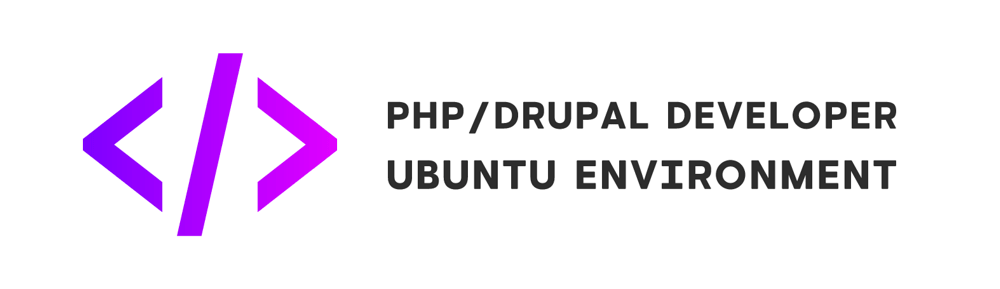

This repo contains Ansible scripts and dotfiles for fast and easy PHP/Drupal developer environment setup on [Ubuntu linux](https://ubuntu.com/). 

## Motivation
Setting up a new PHP/Drupal developer machine can be an ad-hoc, manual, and time-consuming process. The current project aims to simplify the process with instructions and dotfiles/scripts to automate the setup of the following:

## Usage

1. Clone repo.
2. Open [`config.yml`](config.yml) and adjust for your needs.
3. Run `./install.sh` for running system provisor.

---

### Applications list

- ZSH + [antigen](https://github.com/zsh-users/antigen) + [beast config](home/.zshrc)
- [PHP](https://www.php.net/)
- [Composer](https://getcomposer.org/)
  - [PHP codesniffer](https://github.com/squizlabs/PHP_CodeSniffer)
  - [Drupal codesniffer standard](https://git.drupalcode.org/project/coder/tree/8.x-3.x/coder_sniffer)
- [Node](https://nodejs.org/en/)/[NPM](https://www.npmjs.com/) (via [NVM (node version manager)](https://github.com/nvm-sh/nvm)) with set of useful global packages (gulp, eslint, eslint standards, firebase cli, vscode language servers etc.)
- [JetBrains](https://www.jetbrains.com/) IDEs:
  - [PHPStorm](https://snapcraft.io/phpstorm)
  - [PyCharm (CE)](https://snapcraft.io/pycharm-community)
  - [IDEA (CE)](https://snapcraft.io/intellij-idea-community)
  - Optionally any other...
- [Docker](https://www.docker.com/) + [Docksal](https://docksal.io/) for local dev environment
- [Visual Studio Code](https://code.visualstudio.com/) + Plugins + Themes
- ...and many-many more (see [`config.yml`](config.yml) file).

## Tested on following distributions:
- [ubuntu 20.04](https://ubuntu.com/)

- - -

## MIT License

Copyright (c) 2020 [Alexander Danilenko](https://github.com/alexander-danilenko)

Permission is hereby granted, free of charge, to any person obtaining a copy
of this software and associated documentation files (the "Software"), to deal
in the Software without restriction, including without limitation the rights
to use, copy, modify, merge, publish, distribute, sublicense, and/or sell
copies of the Software, and to permit persons to whom the Software is
furnished to do so, subject to the following conditions:

The above copyright notice and this permission notice shall be included in all
copies or substantial portions of the Software.

THE SOFTWARE IS PROVIDED "AS IS", WITHOUT WARRANTY OF ANY KIND, EXPRESS OR
IMPLIED, INCLUDING BUT NOT LIMITED TO THE WARRANTIES OF MERCHANTABILITY,
FITNESS FOR A PARTICULAR PURPOSE AND NONINFRINGEMENT. IN NO EVENT SHALL THE
AUTHORS OR COPYRIGHT HOLDERS BE LIABLE FOR ANY CLAIM, DAMAGES OR OTHER
LIABILITY, WHETHER IN AN ACTION OF CONTRACT, TORT OR OTHERWISE, ARISING FROM,
OUT OF OR IN CONNECTION WITH THE SOFTWARE OR THE USE OR OTHER DEALINGS IN THE
SOFTWARE.
